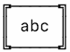
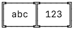

# Duffy

[](https://travis-ci.org/duffyjp/duffy)
[](https://codeclimate.com/github/duffyjp/duffy)
[](https://codeclimate.com/github/duffyjp/duffy/coverage)

This is a collection of reusable things I don't want to keep duplicating in tons of projects.

## Installation

Add this line to your application's Gemfile:

```ruby
gem 'duffy'
```

And then execute:
```shell
$ bundle
```

## String Patches:

Method            | Example         | Output
------------------|-----------------|-------
gender_human      | "F"             | "Female"
md5               | "duffy"         | "904bc6e21e4799ce276200117215b88b"
md5sum            | "duffy"         | "904bc6e21e4799ce276200117215b88b"
nl2br             | "space\nout"    | "space<br/>out"  (requires rails)
pretty_phone      | "1234567890"    | "(123) 456-7890" 
pretty_committer  | "bart"          | "Bartholomew Simpson" (See config)
smart_titlecase   | "this and that" | "This and That" (Note: Has config options. See lib/duffy.rb)
space2nbsp        | "space out"     | "space&nbsp;out" (requires rails)
to_alpha          | "abc123"        | "abc"
to_alpha_numeric  | "abc#$%123"     | "abc123
to_box            | "abc".to_box    | 
to_numeric        | "abc123"        | "123"
to_ssn            | "123456789"     | "123-45-6789"


## Array Patches:
Method            | Example                | Output
------------------|------------------------|-------
to_box            | ['abc', 123].to_box    | 


## Date Patches:
* See config to set your organization's fiscal year start.

Method                   | Example                             | Output
-------------------------|-------------------------------------|-------
beginning_of_fiscal_year | Date.today.beginning_of_fiscal_year | 2017-07-01
end_of_fiscal_year       | Date.today.end_of_fiscal_year       | 2018-06-30
fiscal_year              | Date.today.fiscal_year              | 2018


## NilClass Patches:

Method            | Example         | Output
------------------|-----------------|-------
to_date           | nil             | self (Exists so you can call .to_date on Date, String or nil


## Active Record Aliases:

Alias             | Standard
------------------|---------
accepts           | accepts_nested_attributes_for
habtm             | has_and_belongs_to_many


## Git Access:

Method              |   Result
--------------------|---------
Duffy::Git.branch   | Current git branch.
Duffy::Git.count    | Count of git commits in current branch
Duffy::Git.email    | Local repo's git user.email or global if none.
Duffy::Git.log      | Produce tab separated listing of current git log.


## CPU Detection:
* Linux and Mac only for now, numeric methods return 1 on unsupported hosts.
* `virtual?` detects if the system is hypervisor guest. Will return false if unable to determine.
* Example results for my dual core i5 with hyperthreading.

Method    |   Result
----------|---------
Duffy::System.cpus       | 1
Duffy::System.cores      | 2
Duffy::System.threads    | 4
Duffy::System.sane_load  | 3
Duffy::System.cpu_percent| 16
Duffy::System.virtual?   | true

## Memory Statistics:
* All values returned in Megabytes.
* Available + Used always exactly adds up to Total.

Method    |   Result
----------|---------
Duffy::System.mem_total       | 4096
Duffy::System.mem_available   | 3072
Duffy::System.mem_used        | 1024
Duffy::System.mem_percent     | 25


## View Helpers:
* Rails

Method      | Example                             | Result
------------|-------------------------------------|-------
beast_mode  | beast_mode tags               | renders tag partial in parallel. Only available if you have the Parallel gem in your Gemfile.  You must also wrap your partial in a cache block.


## Contributing

1. Fork it ( https://github.com/[my-github-username]/duffy/fork )
2. Create your feature branch (`git checkout -b my-new-feature`)
3. Commit your changes (`git commit -am 'Add some feature'`)
4. Push to the branch (`git push origin my-new-feature`)
5. Create a new Pull Request
